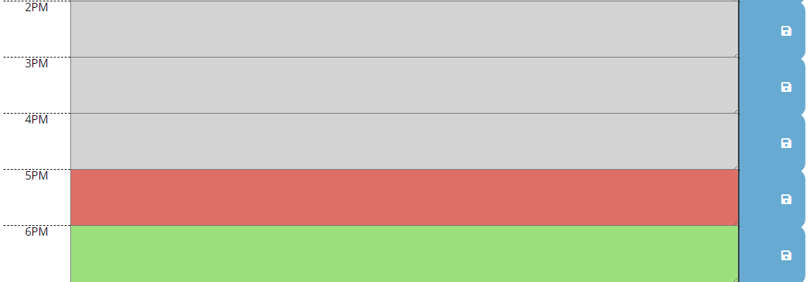
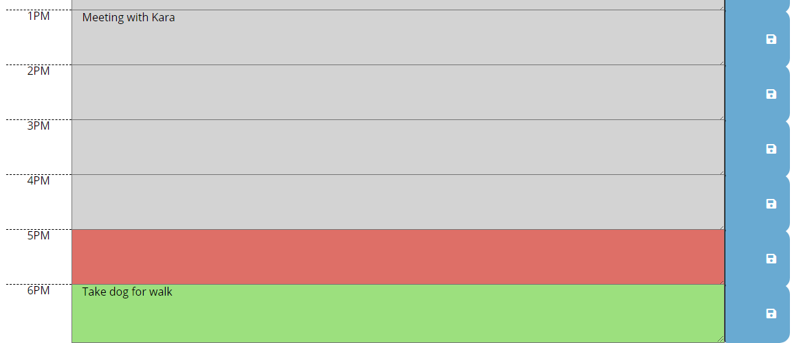

## Work Day Scheduler - Alyson Bennett

## Link to Deployed Application

## List of Technologies Used

* HTML
* CSS
* Bootstrap
* Font Awesome
* Google Fonts
* JavaScript
* jQuery
* MomentJS

## Application Description

This application allows users to schedule their workday events and appointments. The user is able to record their appointments in the hour blocks and save them to local storage. The time blocks will change color based on the time of the day (past, present, and future).

## Screen Shots of Finalized Assignment

First page the user sees when opening the Work Day Scheduler, with current date and time at the top of the page

Shot showing time blocks at 5:33pm, showing red as current hour, grey as past hours, and green as future hours

Shot showing what the user will see when the insert events into the time blocks, save, and refresh the page

## License

The MIT License (MIT)

Copyright (c) 2020 Alyson Bennett

Permission is hereby granted, free of charge, to any person obtaining a copy of this software and associated documentation files (the "Software"), to deal in the Software without restriction, including without limitation the rights to use, copy, modify, merge, publish, distribute, sublicense, and/or sell copies of the Software, and to permit persons to whom the Software is furnished to do so, subject to the following conditions:

The above copyright notice and this permission notice shall be included in all copies or substantial portions of the Software.

THE SOFTWARE IS PROVIDED "AS IS", WITHOUT WARRANTY OF ANY KIND, EXPRESS OR IMPLIED, INCLUDING BUT NOT LIMITED TO THE WARRANTIES OF MERCHANTABILITY, FITNESS FOR A PARTICULAR PURPOSE AND NONINFRINGEMENT. IN NO EVENT SHALL THE AUTHORS OR COPYRIGHT HOLDERS BE LIABLE FOR ANY CLAIM, DAMAGES OR OTHER LIABILITY, WHETHER IN AN ACTION OF CONTRACT, TORT OR OTHERWISE, ARISING FROM, OUT OF OR IN CONNECTION WITH THE SOFTWARE OR THE USE OR OTHER DEALINGS IN THE SOFTWARE.

## Collaborators

I was the sole collaborator on this application.

