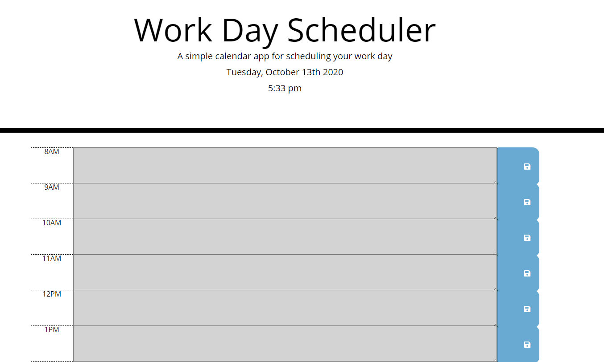
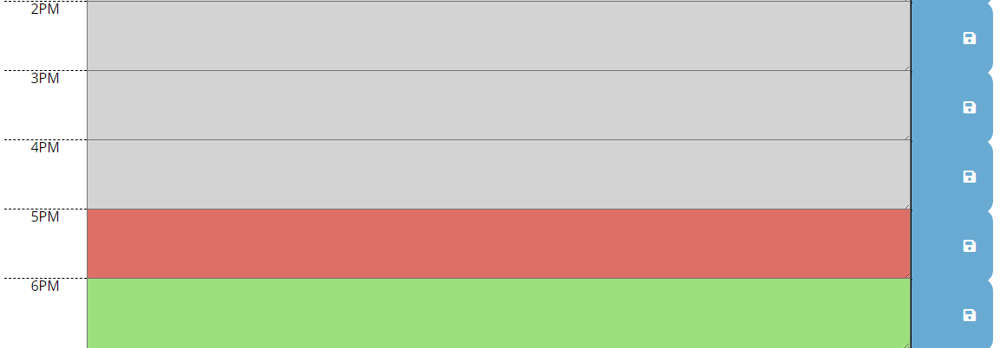
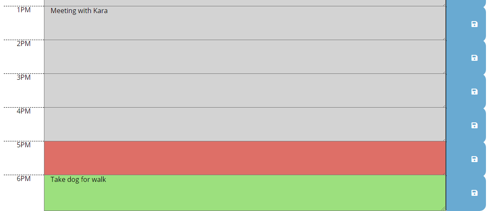

## Work Day Scheduler
Alyson Bennett

## Assignment Objectives
The goal of this assignment was to create a daily planner to manage a schedule. When the user opens the planner, they will see the current date at the top of the page. They are then able to type in events in the hour blocks and save them to local storage. When the page is refreshed, the user is still able to see the events they inserted and saved. Each hour block is color coded to indicate whether that hour is in the past, present, or future. 

## Process
I began this project with using the HTML and CSS pages that were provided. I created elements in the given HTML to show each hour in the work day.

From there, I coded in a JavaScript file. Functions were needed to grab any items set to the local storage, to listen for when the user clicks the save button in the time blocks, set the time block colors, and display the date and time at the top of the screen. 

## Screen Shots of Finalized Assignment

First page the user sees when opening the Work Day Scheduler, with current date and time at the top of the page

Shot showing time blocks at 5:33pm, showing red as current hour, grey as past hours, and green as future hours

Shot showing what the user will see when the insert events into the time blocks, save, and refresh the page

## Final Thoughts
This project was easier than homework assignments prior to this, although it still took some time to research and find answers to a few bugs. I feel that I have a stronger understanding of jQuery and local storage. This was a fun assignment to complete!

Thank you. 

